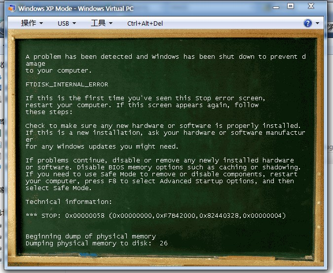

BSODStyle
=========
Restyle your BSOD(Blue Screen Of Death).

Works on Windows XP only.

Usage
=========
1.Launch loader.exe to load driver and bitmap.

2.You may crash the kernel manually to view the effect, ie. http://live.sysinternals.com/Files/NotMyFault.zip

Preview
=========

